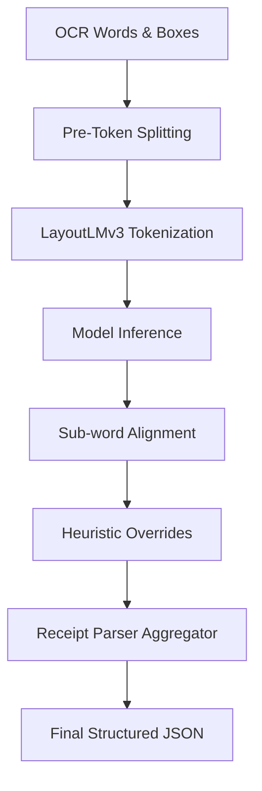

# Receipt Analysis System: Technical Documentation

This document describes the structure and execution details of each phase in the receipt analysis pipeline.

---
# System Documentation

## Overview

The Document Intelligence Pipeline is designed to extract structured information from grocery receipt images captured using mobile devices or scanners. The pipeline integrates traditional computer vision techniques with deep learning models to transform unstructured receipt images into structured data suitable for downstream analytics.

The system follows a modular architecture where each processing stage is encapsulated within an independent service. This design improves maintainability, scalability, and allows individual modules to be upgraded without affecting the overall workflow.

---

## System Architecture

```
Receipt Image
      │
      ▼
Image Loading
      │
      ▼
Image Preprocessing
      │
      ▼
Geometric Correction
      │
      ▼
OCR Engine (PaddleOCR)
      │
      ▼
Bounding Box Normalization
      │
      ▼
LayoutLMv3
      │
      ▼
Receipt Entity Parsing
      │
      ▼
Structured JSON Output
```

---

## Pipeline Components

### 1. Image Loading

The uploaded image is decoded into an OpenCV matrix for subsequent processing.

**Input**
- JPEG Image
- PNG Image

**Output**
- OpenCV Image (NumPy Array)

---

### 2. Image Preprocessing

Enhances receipt quality before OCR.

Main objectives:

- Improve contrast
- Reduce illumination variation
- Improve readability

---

### 3. Geometric Correction

Detects receipt boundaries and removes perspective distortion.

Main objectives:

- Correct skew
- Correct rotation
- Produce top-down receipt image

---

### 4. OCR

Extracts textual content and corresponding bounding boxes using PaddleOCR.

Outputs:

- Words
- Confidence
- Bounding Boxes

---

### 5. LayoutLMv3

Uses both textual and spatial information to classify receipt entities.

Example entities:

- Store Name
- Date
- Total
- Item Name
- Price

---

### 6. Receipt Parsing

Groups predicted entities into structured receipt information.

Example:

```json
{
  "store_name": "DMart",
  "date": "12/06/2026",
  "total": "₹452.50"
}
```

---

## Processing Sequence

1. Upload receipt image.
2. Decode image.
3. Enhance image quality.
4. Correct perspective distortion.
5. Extract text using OCR.
6. Normalize OCR bounding boxes.
7. Perform semantic entity recognition.
8. Parse receipt information.
9. Return structured JSON.

---

## Advantages

- Modular architecture
- High OCR accuracy
- Handles mobile-captured receipts
- Robust against uneven lighting
- Supports semantic understanding through LayoutLMv3

## 🖼️ 1. Image Preprocessing

The image preprocessing layer enhances raw, low-quality receipt images (often capturing uneven lighting, creases, noise, or fading) before text detection.

### Core Modules & Logic

#### Adaptive Contrast Enhancement (CLAHE)
* **Goal**: Normalize uneven lighting and increase contrast on faint thermal ink prints.
* **Implementation**: [PreprocessingService.apply_clahe()](file:///e:/6th%20sem/final%20yr%20project/receipt/backend/app/services/document_intelligence/preprocessing_service.py#L14-L31)
* **How it works**: Converts the image from standard BGR color space to LAB color space. It splits the channels and applies Contrast Limited Adaptive Histogram Equalization (CLAHE) on the Lightness channel (`L`) with a `clipLimit=3.0` and a grid size of `8x8`. This avoids over-amplifying local noise while equalizing background brightness.

#### Edge Preservation Denoising
* **Goal**: Eliminate grain and noise from mobile cameras while keeping text lines sharp.
* **Implementation**: [PreprocessingService.reduce_noise()](file:///e:/6th%20sem/final%20yr%20project/receipt/backend/app/services/document_intelligence/preprocessing_service.py#L33-L41)
* **How it works**: Uses Non-Local Means Denoising (`cv2.fastNlMeansDenoisingColored` or `cv2.fastNlMeansDenoising`) to preserve text edge gradients.

#### Perspective Correction
* **Goal**: Transform skewed or rotated receipts into flat, top-down views.
* **Implementation**: [PerspectiveCorrector.detect_and_correct()](file:///e:/6th%20sem/final%20yr%20project/receipt/backend/app/services/document_intelligence/perspective_corrector.py#L54-L90)
* **How it works**:
  1. Converts the image to grayscale, applies a Gaussian Blur, and runs Canny Edge Detection.
  2. Finds closed contours, sorts them by area, and runs polygon approximation (`cv2.approxPolyDP`).
  3. If a 4-point polygon is detected covering at least 30% of the total image area, it maps coordinates to `(top-left, top-right, bottom-right, bottom-left)`.
  4. Runs a perspective transform (`cv2.warpPerspective`) to project the receipt area flat.

---

## 📖 2. OCR (Input & Output)

The OCR stage extracts character strings and locates their boundaries on the flat receipt.

### Input
An OpenCV image (`np.ndarray`) preprocessed and rectified from the previous stage.

### Output
The OCR engine returns a list of dictionary representations of text boxes.
* **Implementation**: [OCREngine.extract_text()](file:///e:/6th%20sem/final%20yr%20project/receipt/backend/app/services/document_intelligence/ocr_engine.py#L35-L65)
* **Format**:
  ```python
  [
      {
          "text": "TOTAL",
          "confidence": 0.998,
          "bbox": [[114, 920], [183, 920], [183, 970], [114, 970]], # tl, tr, br, bl
          "width": 69,
          "height": 50
      },
      ...
  ]
  ```

* **Core Engine**: The project uses **PaddleOCR** due to its state-of-the-art text line detection (using a Differentiable Binarization / DB network) and text recognition (using a CRNN-based model).

---

## 🤖 3. Downstream Processing (What Happens Next?)

Once OCR yields words and bounding boxes, they go through text tokenization, prediction, and heuristic parsing.



### Downstream Steps

#### A. Pre-Token Splitting
* **Implementation**: [LayoutLMService._split_merged_tokens()](file:///e:/6th%20sem/final%20yr%20project/receipt/backend/app/services/document_intelligence/layoutlm_service.py#L182-L238)
* **Logic**: OCR engines sometimes group words horizontally if they are close. To prevent layout classification errors, strings containing whitespace are split, and alphanumeric mergers (like `"Qty2.00"` or `"PB1"`) are split into separate tokens. Bounding boxes are divided horizontally based on relative character length.

#### B. Coordinate Normalization
* **Implementation**: [OCRService.extract_structured_data()](file:///e:/6th%20sem/final%20yr%20project/receipt/backend/app/services/ocr_service.py#L56-L66)
* **Logic**: Bounding box coordinates are scaled to a `[0, 1000]` range using the formula:
  $$\text{box}_{\text{normalized}} = \text{box}_{\text{pixel}} \times \frac{1000}{\max(W, H)}$$
  This makes the layout features scale-invariant before passing them to LayoutLMv3.

#### C. LayoutLMv3 Tokenization & Inference
* **Implementation**: [LayoutLMService.predict_entities()](file:///e:/6th%20sem/final%20yr%20project/receipt/backend/app/services/document_intelligence/layoutlm_service.py#L54-L110)
* **Logic**: Runs the model using the `LayoutLMv3Processor` to tokenize words into sub-word pieces, creating spatial and visual embedding layers.

#### D. Sub-word Alignment
* **Logic**: The tokenizer splits words into subtokens (e.g. `"WAGYU"` ➡️ `"WAG"`, `"##YU"`), adding special tokens like `<s>` and `</s>`. The output token predictions are mapped back to the original word list using `encoding.word_ids(batch_index=0)`. The prediction of the first subtoken is assigned to the whole word.

#### E. Heuristic Overrides
* **Logic**: Fixes remaining model classification errors using regular expression overrides. For example:
  * If a token is labeled as `O` or `sub_total.subtotal_price` but contains discount keywords (e.g., `"DISC"`, `"PROMO"`), it is overridden to `sub_total.discount_price`.
  * Negative numbers starting with `-` or enclosed in `( )` are overridden to `sub_total.discount_price`.

#### F. Receipt Parser Aggregator
* **Implementation**: [LayoutLMService.parse_receipt_entities()](file:///e:/6th%20sem/final%20yr%20project/receipt/backend/app/services/document_intelligence/layoutlm_service.py#L112-L181)
* **Logic**: Iterates over predicted entity words to construct a structured JSON object containing:
  * **Items list**: Combines consecutive words labeled `menu.nm` (Item Name), reads `menu.cnt` (Quantity), and parses `menu.price` (Total Item Price).
  * **Totals**: Extracts subtotal and grand total.
  * **Fallback**: Runs a regex parser fallback ([RegexParser](file:///e:/6th%20sem/final%20yr%20project/receipt/backend/app/services/document_intelligence/regex_parser.py)) for merchant names, dates, or missing totals.

---

## 🏋️ 4. LayoutLMv3 Training & Fine-Tuning

This section covers the offline training workflow.

### Dataset Structure
The model is fine-tuned on the CORD (Complex Receipt OCR Dataset) split into:
* **Train**: 800 samples
* **Validation (Dev)**: 100 samples
* **Test**: 50 samples

CORD annotations define coordinate points (`quad` coordinates `x1` to `y4`) and text labels for **22 semantic classes** (e.g. `menu.nm`, `menu.price`, `total.total_price`, `sub_total.tax_price`).

### Training Pipeline Logic
* **Implementation**: [train_layoutlmv3.py](file:///e:/6th%20sem/final%20yr%20project/receipt/backend/train_layoutlmv3.py)
* **Label Masking**: During dataset tokenization, subtokens and padding tokens are assigned a label index of `-100`. PyTorch's loss function ignores `-100` targets, focusing backpropagation only on the first sub-token of each actual word.
* **Hyperparameters**:
  * **Base Model**: `microsoft/layoutlmv3-base` (135 million parameters).
  * **Optimizer**: AdamW.
  * **Learning Rate**: `1e-5`.
  * **Scheduler**: Linear with warmup.
  * **Trainer Setup**: Utilizes HuggingFace `Trainer` and `DataCollatorForTokenClassification` for batch padding.
  * **Output**: The best checkpoints are stored under `backend/layoutlmv3-finetuned/`.
